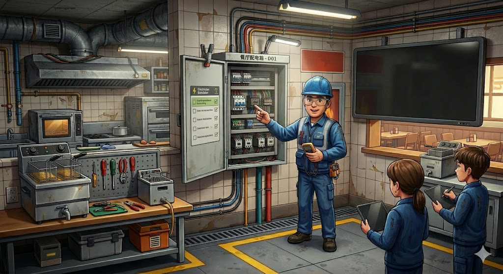

# 学徒电工 — C-10 Restaurant Electrical Training Game

A browser-based first-person training simulation for aspiring C-10 (Electrical Contractor) apprentices. Set inside a restaurant under renovation, you perform real-world electrical tasks that map directly to California C-10 licensing exam objectives.

**[▶ Live Demo](https://83737d19.electrician-training-web-game.pages.dev/)**

---



---

## What You'll Learn

Each task in the game corresponds to a genuine C-10 exam topic:

| Task | Exam Topic |
|------|-----------|
| Read the electrical plan (E-101) | Blueprint reading, circuit identification |
| Interpret the fryer nameplate | Load calculation, continuous-load rule (125%) |
| Calculate wire & breaker size | NEC ampacity, voltage drop, overcurrent protection |
| Install conduit & junction boxes | Wiring methods, box-fill calculations |
| Wire the dedicated circuit | Branch-circuit requirements, grounding |
| Test with a voltage tester | Energized-work safety, PPE |
| Measure with a multimeter | Voltage/continuity testing, fault isolation |
| Final inspection & sign-off | Inspection checklist, code compliance |

---

## Gameplay

You are an apprentice electrician sent by your mentor to a restaurant (海湾小馆 / Bayside Bistro) that needs a new dedicated circuit for a 5 kW commercial deep fryer. Complete every step of the job — from reading the drawings to passing the final walkthrough.

### Objectives (Work Order #1042)

1. **Read the electrical plan** — identify which circuit is correct for the fryer
2. **Check the nameplate** — calculate minimum conductor and breaker size
3. **Install the conduit run** — route EMT from panel LP-1 to the kitchen
4. **Connect junction boxes J-1 and J-2** — torque terminals to spec
5. **Wire the fryer outlet** — correct polarity, grounding, and strain relief
6. **Energize & test** — verify voltage at the receptacle with your meter
7. **Pass the inspector** — answer the sign-off quiz to complete the job

Each completed step unlocks an in-game teaching card and a quiz question. Answer correctly to earn your Certificate of Completion.

---

## Controls

| Key / Action | Function |
|---|---|
| `W A S D` | Move |
| Mouse | Look around |
| `E` | Interact with highlighted object |
| `1` – `5` | Switch tool |
| `B` | Open field manual (textbook) |
| `Esc` | Release mouse pointer |

### Tools

| Slot | Tool | Use |
|---|---|---|
| 1 | Bracket / Hand | Pick up, inspect, install |
| 2 | Voltage Tester (验电笔) | Check live/dead status |
| 3 | Multimeter (万用表) | Measure voltage, continuity |
| 4 | Wire Spool (线缆) | Pull wire through conduit |
| 5 | Screwdriver (螺丝刀) | Tighten terminals, remove covers |

---

## Running Locally

No build step required — the entire game is a single `index.html` file.

```bash
git clone https://github.com/cma00000/electrician-training-web-game.git
cd electrician-training-web-game
# Open index.html in any modern browser, or serve it:
python3 -m http.server 8080
```

Then open `http://localhost:8080` in Chrome, Firefox, or Edge.

> **Requirements:** Desktop browser with WebGL support. Keyboard and mouse required (no mobile support).

---

## Technical Notes

- Built with **Three.js r128** (CDN, no bundler)
- Single-file HTML — no dependencies to install
- Renderer: `MeshLambertMaterial` / `MeshPhongMaterial` throughout for smooth 60 fps on integrated graphics
- Raycasting against a flat `allMeshes[]` array (not recursive scene traversal) for low-latency hover detection
- 3D tool cursors attached to camera-space group (`camera.add(cursorGroup)`)
- Toolbar thumbnails rendered via `WebGLRenderTarget` + manual Y-flip into 2D canvas

---

## License

&copy; 2024 Bayside Electric Training Project

This project is released under a **non-commercial license**.

You are free to:
- View, study, and run the code for personal or educational use
- Fork and modify for non-commercial learning or research purposes

You may **not**:
- Use this project or any derivative in a commercial product or service
- Sell, sublicense, or monetize the code or assets in any form
- Remove or alter copyright notices

For commercial licensing inquiries, contact the repository owner.

This project is inspired by real C-10 exam content but is not affiliated with, endorsed by, or certified by the California Contractors State License Board (CSLB) or any official examination body.
